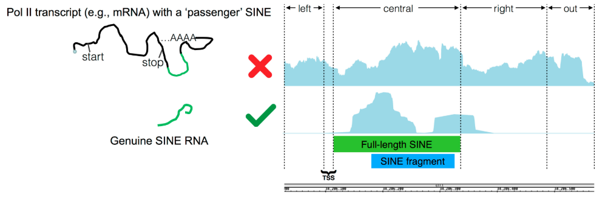

# SINEsFind

**Author**: Davide Carnevali (davide.carnevali@crg.eu)
### Abstract

Short Interspersed Element (SINE) retrotransposons are one of the
most abundant DNA repeat elements in the human genome. They have been found to
impact the expression of protein-coding genes, but the possible roles in cell
physiology of their noncoding RNAs, generated by RNA polymerase (Pol) III, are
just starting to be elucidated. For this reason, Short Interspersed Element
(SINE) expression profiling is becoming mandatory to obtain a comprehensive
picture of their regulatory roles. However, their repeated nature and frequent
location within Pol II-transcribed genes represent a serious obstacle to the
identification and quantification of genuine, Pol III-derived SINE transcripts
at single-locus resolution on a genomic scale. Among the recent Next Generation
Sequencing technologies, only RNA sequencing (RNA-Seq) holds the potential to
solve these issues, even though both technical and biological matters need to
be taken into account. A bioinformatic pipeline has been recently set up that,
by exploiting RNA-seq features and knowledge of SINE transcription mechanisms,
allows for easy identification and profiling of transcriptionally active genomic

#### How it works
SINEsFind allows to detect free SINE RNAs by using paired-end RNA-Seq data.
It works by comparing the level of the expression coverage onto the SINE element
with those upstream and downstream of it to it. In this way SINEs_Find is able to distinguish a free PolIII-transcribed SINE RNA from one that is passenger of
longer PolII transcript.
For a complete description of the tool, check the reserach paper [here](https://www.mdpi.com/2311-553X/3/1/15)

#### Requirements:
SINEs_find works with Python version 3.x and needs the following packages to be
installed:
 - Biopython
 - EMBOSS suite
 - HTSeq
 - pyBedTools
 - pyBigWig
 - Pandas
 - Numpy

#### Usage
SINEsFind works with paired-end RNA-Seq data, both stranded or not, however to
exploit its potential it is **recommended** to use paired-end stranded reads at
least 75 nt long. It works both with bam or bigwig files, the latter being much
more faster (10x).

1. The first step is to build an index of the SINEs annotation by
using the **AnnoGenerate.py** script which calculate the genomic coordinates of
the **expected full-lenght** SINE element (see more in the reference paper below).  
It expects as input the annotation file containing the SINEs of interest (Alu/MIR)
in GTF format (either gzipped or not) and the fasta sequence of the human
reference genome. The output file will cill be the input GTF annotation file with additional 2 columns corresponding to the calculated start/end genomic coordinates
of the expected full-length element. The annotation folder contains already the
pre-computed extended annotation file for Alu elements in GRCh38 reference genome
that do not overlap, in the same orientation, any of the genes annotated in
Gencode version 24.  

 **Example**: python AnnoGenerate.py *alus.gtf.gz* *hg38.fa* *outputname*

2. Once the extended annotation index has been created, we can run SINEsFind as
follow using BAM file as input and using default parameters:  
python SINEs_find.py -s auto -t bam *bamfile* *annotation_file* *chrom_sizes* *output_file*  

SINEs_find has several optional parameters that can be adjusted to user's need
such as:
-  The ratio of the expression coverage between the upstream/downstream
regions and the SINE element
- The length of the upstream/downstream regions
- How many times the SINE expression coverage area should be greater than the calculated background  

Please, run SINEs_find -h to view the **Help** and discover all available
parameters

#### Output
The output file of the SINEs_find tool contains the name and the genomic
coordinates of all the putative SINE elements found. It also reports the expression coverage area of the upstream, central, downstream and 'out' regions, as well as
the calculated background expression value for each chromosome.  
When using BAM file as input, it save the expression coverage of the Watson and
Crick strands inBedGraph format.

The expression coverage area is reported as number of bases covered by the reads
mapping onto the corresponding region.  **Example**: 10 paired-end reads of 100 nt
lenght will be reported as 2000 (10x2x100)

#### Citations
If you use SINEs_Find in your research, **please cite this paper**  
* Carnevali D, Dieci G. **[Identification of RNA Polymerase III-Transcribed SINEs at Single-Locus Resolution from RNA Sequencing Data.](https://www.mdpi.com/2311-553X/3/1/15)** Non-Coding RNA 2017, 3(1), 15.
